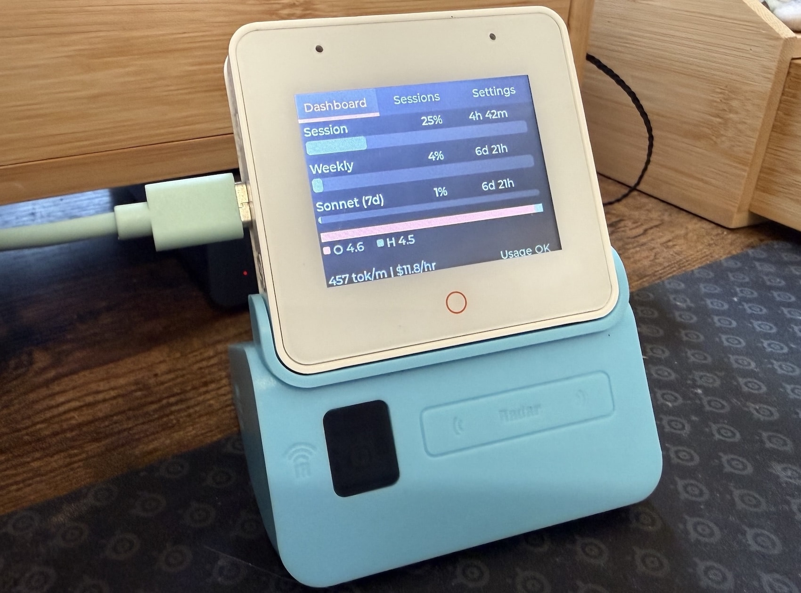

# ESPClaude

ESP32-S3 Box 3 firmware that displays Claude Code usage on a desk-mounted screen. Polls a [CCU](https://github.com/sammcj/ccu) API server over WiFi and shows session/weekly utilisation, per-model cost distribution, burn rate, and limit predictions.



## Hardware

- ESP32-S3 Box 3 (16MB flash, 16MB PSRAM, 320x240 LCD)

## Setup

1. Install [ESP-IDF v5.x](https://docs.espressif.com/projects/esp-idf/en/v5.5.2/esp32s3/get-started/)
2. Copy the firmware config and set your WiFi credentials and server URL:

```sh
cp firmware/main/config.h.example firmware/main/config.h
# edit config.h with your WIFI_SSID, WIFI_PASSWORD, and SERVER_URL
```

3. Build and flash:

```sh
make firmware-build
make firmware-flash
```

4. Monitor serial output:

```sh
make firmware-monitor
```

## Configuration

All firmware settings live in `firmware/main/config.h`:

| Setting                       | Description                                 |
| ----------------------------- | ------------------------------------------- |
| `WIFI_SSID` / `WIFI_PASSWORD` | WiFi credentials                            |
| `SERVER_URL`                  | CCU API server address                      |
| `API_TOKEN`                   | Bearer token for CCU auth (optional)        |
| `POLL_INTERVAL_MS`            | API polling interval (default 20s)          |
| `POLL_FAST_INTERVAL_MS`       | Fast poll until first response (default 2s) |
| `STALE_DATA_SECONDS`          | Warn if no API data for this long (default 15m) |
| `SLEEP_AFTER_MS`              | Blank screen after idle period (default 9h) |
| `THEME_ID`                    | Colour theme: 0 = default, 1 = Anthropic   |

The API_TOKEN should match the token configured in CCU.

## Architecture

```
firmware/main/
  main.c            -- entry point, WiFi + NTP + HTTP init
  http_client.c/h   -- polls CCU /api/status, parses JSON
  config.h          -- WiFi, server, display settings
  ui/
    ui.c/h              -- tabview, sleep mode, stale-data warning
    screen_dashboard.c  -- usage bars, model distribution, burn rate
    screen_instances.c  -- session details
    screen_settings.c   -- WiFi status, sleep countdown
    theme.c/h           -- colour palettes (default + Anthropic)
```

## Licence

MIT
